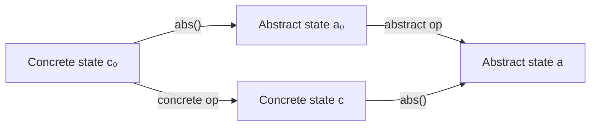

# Imperative Programming — Complete Study Guide (Lectures 1–20)

---

## Table of Contents

- [PART 1: Programming with State (Lectures 1–9)](#part-1-programming-with-state-lectures-19)
  - [1. Scala Basics & Introduction](#1-scala-basics--introduction-lecture-1)
  - [2. Loop Invariants](#2-loop-invariants-lecture-2)
  - [3. More on Invariants & Patterns](#3-more-on-invariants--patterns-lecture-3)
  - [4. Testing](#4-testing-lecture-4)
  - [5. Debugging & String Searching](#5-debugging--string-searching-lecture-5)
  - [6. Printing Numbers in Decimal](#6-printing-numbers-in-decimal-lecture-6)
  - [7. Binary Search](#7-binary-search-lecture-7)
  - [8. Quicksort](#8-quicksort-lecture-8)
  - [9. Maximum Segment Sums](#9-maximum-segment-sums-lecture-9)
- [PART 2: Data Structures & Encapsulation (Lectures 10–20)](#part-2-data-structures--encapsulation-lectures-1020)
  - [10. Modularisation & Object Orientation](#10-modularisation--object-orientation-lecture-10)
  - [11. Abstract Datatypes (ADTs) & Traits](#11-abstract-datatypes-adts--traits-lecture-11)
  - [12. Implementing ADTs — DTI & Abstraction Function](#12-implementing-adts--dti--abstraction-function-lecture-12)
  - [13. Refining Datatypes](#13-refining-datatypes-lecture-13)
  - [14. Linked Lists](#14-linked-lists-lecture-14)
  - [15. Programming with ADTs — BFS & Queues](#15-programming-with-adts--bfs--queues-lecture-15)
  - [16. Bit Maps & Hash Tables](#16-bit-maps--hash-tables-lecture-16)
  - [17. Hash Tables & Binary Search Trees](#17-hash-tables--binary-search-trees-lecture-17)
  - [18. BST Operations](#18-bst-operations-lecture-18)
  - [19. Priority Queues](#19-priority-queues-lecture-19)
  - [20. Sudoku — Putting It All Together](#20-sudoku--putting-it-all-together-lecture-20)
- [Key Concept Summary Table](#key-concept-summary-table)

---

# PART 1: Programming with State (Lectures 1–9)

## 1. Scala Basics & Introduction (Lecture 1)

### Imperative vs Functional Programming

| Functional | Imperative |
|---|---|
| Programs = mathematical functions applied to arguments | Programs = successive statements changing state |
| **No state** | State stored in **variables** |
| Prove correctness via **induction** | Prove correctness via **invariants** |

### Scala Essentials

- **`def`** introduces functions; **`val`** introduces immutable values; **`var`** introduces mutable variables.
- Return type may be inferred; last expression is the return value.
- **`Unit`** = void (no useful return value).
- **`require(cond)`** checks a **precondition** at runtime.

```scala
/** Calculate factorial of n
  * Pre: n >= 0
  * Post: returns n! */
def fact(n: Int): BigInt = {
  require(n >= 0)
  if (n == 0) 1 else fact(n - 1) * n
}
```

### Key Definitions

> [!IMPORTANT]
> **Precondition**: A condition that must be true *before* code execution. If violated, the effect is **undefined**.
>
> **Postcondition**: A condition that is true *after* code execution terminates normally.

---

## 2. Loop Invariants (Lecture 2)

### The Invariant Pattern

> [!IMPORTANT]
> An **invariant** is a property that is true at the **start and end** of each iteration of a loop.

The standard pattern:

```
// pre
Init
// I                          ← invariant established
while (test) {
    // I && test
    Body
    // I                      ← invariant maintained
}
// I && !test                 ← implies post
// post
```

**To prove correctness:**
1. `Init` establishes `I` (assuming `pre`).
2. `Body` maintains `I`.
3. `I && !test` implies `post`.
4. The loop **terminates** (via a variant).

### Variant (for termination)

> [!IMPORTANT]
> A **variant** is an integer-valued expression `v` of program variables such that:
> - `v >= 0` (assuming the invariant),
> - `v` is **decreased** on each iteration.

### Hoare Triples

The notation `{P} Prog {Q}` means: if `Prog` starts in a state satisfying `P`, it terminates in a state satisfying `Q`.

### Example: Array Sum

```scala
/** Post: returns sum(a[0..n)) */
def findSum(a: Array[Int]): Int = {
  val n = a.size
  var total = 0; var i = 0
  // Invariant I: total = sum(a[0..i)) && 0 <= i <= n
  while (i < n) {
    total += a(i)    // total = sum(a[0..i+1))
    i += 1           // I restored
  }
  // I && i == n  =>  total = sum(a[0..n))
  total
}
```

**Variant:** `n - i`

### Invariant Pattern: Replace a Constant with a Variable

| Program | Postcondition | Invariant |
|---------|--------------|-----------|
| `fact` | `f = n!` | `f = i! && i <= n` |
| `findSum` | `total = Σa[0..n)` | `total = Σa[0..i) && 0 <= i <= n` |
| `exp` | `y = x^n` | `y = x^i && i <= n` |

The postcondition mentions a constant (like `n`); the invariant replaces it with a variable (like `i`) that *grows towards* the constant.

---

## 3. More on Invariants & Patterns (Lecture 3)

### `for` vs `while`

```scala
for (i <- a until b) Body
// is equivalent to:
var i = a
while (i < b) { Body; i = i + 1 }
```

Invariants are easier to reason about with `while` loops.

### Fast Exponentiation

Uses the invariant `y * z^k = x^n && 0 <= k <= n` with variant `k`:

```scala
/** Pre: n >= 0; Post: returns x^n */
def exp(x: Double, n: Long): Double = {
  require(n >= 0)
  // Invariant: y * z^k = x^n && 0 <= k <= n. Variant: k
  var y = 1.0; var z = x; var k = n
  while (k > 0) {
    if (k % 2 == 0) { z = z * z; k = k / 2 }
    else            { y = y * z; z = z * z; k = k / 2 }
  }
  // I && k == 0  =>  y = x^n
  y
}
```

This runs in **O(log n)** time, compared to **O(n)** for the naive version.

### `map` and Anonymous Functions

```scala
val a = args.map(_.toInt)     // convert Array[String] -> Array[Int]
```

---

## 4. Testing (Lecture 4)

### Key Testing Concepts

| Concept | Description |
|---------|-------------|
| **Unit testing** | Testing individual units (functions); tests are small, independent, and check one thing |
| **Black-box testing** | Tests based on specification only (no knowledge of internals) |
| **White-box testing** | Tests with knowledge of implementation (can check invariants, path coverage) |
| **Equivalence class testing** | Divide inputs into classes with expected same behaviour; test one per class |
| **Boundary-value testing** | Concentrate tests near boundaries between equivalence classes |
| **Regression testing** | Re-run entire test suite after changes to catch unintended breakage |

### ScalaTest

```scala
import org.scalatest.funsuite.AnyFunSuite

class TestExp extends AnyFunSuite {
  test("2^3 = 8")  { assert(exp(2.0, 3) === 8.0) }
  test("2^0 = 1")  { assert(exp(2.0, 0) === 1.0) }
  test("negative exponent") {
    intercept[IllegalArgumentException] { exp(2.0, -1) }
  }
}
```

- Use `===` (triple equals) for better error messages.
- Use `intercept[ExceptionType]{ ... }` to test that exceptions are thrown.
- Floating point: use tolerances `assert(result === expected +- tolerance)`.

### Hierarchy of Error Handling

| Level | Action |
|-------|--------|
| 1 | Fix safely; warn user if needed |
| 2 | Throw exception (user-input errors) — `require` |
| 3 | Trip assertion (should-never-happen errors) — `assert` |

---

## 5. Debugging & String Searching (Lecture 5)

### Debugging Techniques
- Add `println` statements to trace state variables.
- Use `assert` to check invariants hold during execution.
- Check that variant is actually decreasing.
- Test functions **in isolation** before integrating.

### String Equality — Invariant Development

Four progressively better versions of array equality check:

**Version 1** (full scan):
```scala
var k = 0; var equal = true; val n = a.size
while (k < n) { equal = equal && a(k) == b(k); k += 1 }
// Invariant: equal = (a[0..k) == b[0..k))
```

**Version 2** (early exit):
```scala
while (k < n && equal) { equal = a(k) == b(k); k += 1 }
```

**Version 3** (no `equal` variable):
```scala
while (k < n && a(k) == b(k)) k += 1
// (a[0..n) == b[0..n)) iff (k == n)
k == n
```

### String Searching (`grep`)

```scala
def search(patt: Array[Char], line: Array[Char]): Boolean = {
  val K = patt.size; val N = line.size
  // Invariant: found = (line[i..i+K) = patt[0..K) for some i in [0..j))
  var j = 0; var found = false
  while (j <= N - K && !found) {
    var k = 0
    while (k < K && line(j + k) == patt(k)) k += 1
    found = (k == K)
    j += 1
  }
  found
}
```

---

## 6. Printing Numbers in Decimal (Lecture 6)

### Key Idea: Strengthen the Invariant

Start with a simple invariant, then **add clauses** to carry state forward between iterations (e.g., `x = 10^n`, `u = t div 10^n`), making the program more efficient.

**Efficient version** (right-to-left):
```scala
// Invariant: (for all i in [0..n), d(i) = t@i) && u = t div 10^n
var n = 0; var u = t
while (u != 0) {
  d(n) = u % 10      // d(n) = (t div 10^n) % 10 = t@n
  u = u / 10          // u = t div 10^(n+1)
  n = n + 1
}
```

> [!TIP]
> If you have state carried forward from one iteration to the next, **the invariant should explain that state**.

---

## 7. Binary Search (Lecture 7)

### Integer Square Root

**Linear search** — invariant `a^2 <= y`, runs in O(√y):
```scala
var a = 0
while ((a + 1) * (a + 1) <= y) a = a + 1
```

**Binary search** — invariant `a^2 <= y < b^2 && 0 <= a < b`, runs in O(log y):
```scala
var a = 0; var b = y
while (a + 1 < b) {
  val m = (a + b) / 2
  if (m * m <= y) a = m else b = m
}
```

### Binary Search in a Sorted Array

> [!IMPORTANT]
> **Binary search invariant:** `a[0..i) < x <= a[j..N) && 0 <= i <= j <= N`

```scala
var i = 0; var j = N
while (i < j) {
  val m = (i + j) / 2    // i <= m < j
  if (a(m) < x) i = m + 1 else j = m
}
// I && i == j, so a[0..i) < x <= a[i..N)
```

- Use `i = m + 1` in the "then" case (not `i = m`) to ensure progress.
- Cannot set `j = m - 1` in the "else" case (would lose the element at `m`).
- Runs in **O(log N)** time.

---

## 8. Quicksort (Lecture 8)

### Algorithm
1. If segment has ≤ 1 elements, return.
2. Pick a **pivot** (first element).
3. **Partition** around pivot.
4. Recursively sort left and right sub-segments.

### Partition Invariant

```
a[l+1..i) < p = a(l) <= a[j..r)  &&  l < i <= j <= r
```

```scala
def partition(l: Int, r: Int): Int = {
  val p = a(l)  // pivot
  // Invariant: a[l+1..i) < p <= a[j..r) && l < i <= j <= r
  var i = l + 1; var j = r
  while (i < j) {
    if (a(i) < p) i += 1
    else { val t = a(i); a(i) = a(j - 1); a(j - 1) = t; j -= 1 }
  }
  // swap pivot into position
  a(l) = a(i - 1); a(i - 1) = p
  i - 1
}

def QSort(l: Int, r: Int): Unit = {
  if (r - l > 1) {
    val k = partition(l, r)
    QSort(l, k); QSort(k + 1, r)
  }
}
```

- **Average case:** O(n log n)  
- **Worst case:** O(n²) (when pivot is always min/max)
- Works **in-situ** (no auxiliary data structures)

---

## 9. Maximum Segment Sums (Lecture 9)

Three algorithms with decreasing complexity:

### Algorithm 1: O(N³)
Nested loops + `segsum` call for each pair `(p, q)`.

### Algorithm 2: O(N²)
Calculate segment sums incrementally: `segsum(a, m, n) = a(m) + segsum(a, m+1, n)`.

### Algorithm 3: O(N) — The Clever One

> [!IMPORTANT]
> Uses an auxiliary variable `mrss` = max right segment sum ending at current position.

**Invariant:**
- `mss = max{segsum(a, p, q) | 0 <= p <= q <= n}`
- `mrss = max{segsum(a, p, n) | 0 <= p <= n}`

```scala
var n = 0; var mss = 0; var mrss = 0
while (n < N) {
  n = n + 1
  mrss = (mrss + a(n - 1)) max 0
  mss = mss max mrss
}
```

**Key insight:** `mrss` for position `n` equals `(mrss_prev + a(n-1)) max 0` — either extend the previous segment or start fresh.

---

# PART 2: Data Structures & Encapsulation (Lectures 10–20)

## 10. Modularisation & Object Orientation (Lecture 10)

### Three Pillars

| Principle | Meaning |
|-----------|---------|
| **Decomposition / Modularity** | Split into modules, each with a single well-understood role and well-defined interface |
| **Abstraction & Encapsulation** | Components = black boxes; implementation details hidden; interchangeable if same spec |
| **Reusability** | Reuse existing components; design new ones to be reusable |

### Objects and Classes

- **Object**: has data + operations; private data, public interface.
- **Class**: template for creating multiple objects of the same kind.
- **`this`**: reference to current object.
- **`private`**: restricts access to within the class/object.

### Identity vs Equality

```scala
a eq b    // reference equality — same object?
a == b    // content equality (delegates to .equals)
```

Override `equals` for content equality:
```scala
override def equals(other: Any): Boolean = other match {
  case b: Point => this.x == b.x && this.y == b.y
  case _        => false
}
```

### Inheritance vs Composition

| Inheritance ("is-a") | Composition ("has-a") |
|--------|-------------|
| `class PlainText extends Text` | `class PlainText { private val text = new Text() }` |
| Tight coupling; fragile base class problem | Loose coupling; more flexible |
| Use `override` for changed methods | Delegate to contained object |

### Dynamic Binding
The **dynamic type** (runtime type) of an object determines which method implementation is invoked.

---

## 11. Abstract Datatypes (ADTs) & Traits (Lecture 11)

> [!IMPORTANT]
> An **Abstract Datatype (ADT)** gives a generic, idealised description of data and operations, specified by:
> - **state**: the abstract state
> - **init**: the initial state
> - **pre/postconditions** on each operation
>
> In Scala, ADTs correspond to **traits**.

### Traits in Scala

```scala
trait IntSet {
  def isEmpty: Boolean
  def contains(x: Int): Boolean
  def insert(x: Int): Unit
  def delete(x: Int): Unit
}

// Different implementations extend the trait:
class ArrayIntSet(MAX: Int) extends IntSet { ... }
class BitmapIntSet(MAX: Int) extends IntSet { ... }
```

- Traits can have **abstract** and **concrete** methods.
- A class can extend **multiple** traits (mix-in composition).
- Traits **cannot** maintain instance state (they use abstract fields).

### Specifying ADTs — Example: `Set[A]`

```scala
/** state: S : P(A)
  * init:  S = {} */
trait Set[A] {
  /** post: S = S_0 ∪ {elem} */
  def add(elem: A): Unit

  /** post: S = S_0 ∧ returns (elem ∈ S) */
  def contains(elem: A): Boolean

  /** post: S = S_0 ∧ returns #S */
  def size: Int
}
```

### Specifying ADTs — Example: `Book` (Phone Book)

```scala
/** state: book : String → String
  * init:  book = {} */
trait Book {
  /** post: book = book_0 ⊕ {name → number} */
  def store(name: String, number: String): Unit

  /** pre:  name ∈ dom book
    * post: book = book_0 ∧ returns book(name) */
  def recall(name: String): String

  /** post: book = book_0 ∧ returns (name ∈ dom book) */
  def isInBook(name: String): Boolean
}
```

Here `⊕` means function override: `(f ⊕ g)(x) = g(x)` if `x ∈ dom g`, else `f(x)`.

---

## 12. Implementing ADTs — DTI & Abstraction Function (Lecture 12)

> [!IMPORTANT]
> ### The Three Key Concepts
>
> | Concept | Definition | Scala analogue |
> |---------|-----------|----------------|
> | **Abstract Datatype (ADT)** | Generic description (state + operations + pre/post) | `trait` |
> | **Concrete Datatype** | An implementation | `class` / `object` |
> | **Datatype Invariant (DTI)** | Property true initially and maintained by every operation | Documented in comments |
> | **Abstraction Function** | Function `abs(c)` mapping concrete state `c` to abstract state `a` | Documented in comments |

### Example: `ArraysBook`

```scala
object ArraysBook extends Book {
  private val MAX = 1000
  private val names   = new Array[String](MAX)
  private val numbers = new Array[String](MAX)
  private var count   = 0

  // Abs: book = { names(i) → numbers(i) | i ∈ [0..count) }
  // DTI: 0 <= count <= MAX &&
  //      ∀ i,j ∈ [0..count) (i ≠ j ⇒ names(i) ≠ names(j))

  private def find(name: String): Int = {
    var i = 0
    while (i < count && names(i) != name) i += 1
    i
  }

  def isInBook(name: String): Boolean = find(name) < count

  def recall(name: String): String = {
    val i = find(name); assert(i < count); numbers(i)
  }

  def store(name: String, number: String): Unit = {
    val i = find(name)
    if (i == count) { assert(count < MAX); names(i) = name; count += 1 }
    numbers(i) = number
  }
}
```

### Correctness Conditions

To prove a concrete implementation meets its ADT specification:
1. Initial concrete state `c_0` satisfies DTI.
2. `abs(c_0)` matches abstract `init`.
3. For each operation, assuming DTI and abstract precondition hold:
   - Operation terminates without error.
   - Resulting state satisfies DTI.
   - Abstract postcondition holds for `(a_0, abs(c), abs(res))`.



---

## 13. Refining Datatypes (Lecture 13)

### Pairs and Tuples

```scala
val p: (String, String) = ("Gavin", "73841")
val x = p._1    // "Gavin"
val y = p._2    // "73841"
val (a, b) = p  // pattern matching
```

### Case Classes

```scala
case class Entry(name: String, number: String)

// Benefits:
// - No "new" needed: Entry("Gavin", "73841")
// - Compiler provides equals, toString, hashCode
// - Pattern matching: val Entry(n, num) = entries(i)
// - Immutable by default
```

### Linked Lists

```scala
class Node(var name: String, var number: String, var next: Node)

class LinkedListBook extends Book {
  private var list: Node = null
  // Abs: book = { n.name → n.number | n ∈ L(list) }
  // DTI: L(list) is finite, names in L(list) are distinct

  private def find(name: String): Node = {
    var n = list
    while (n != null && n.name != name) n = n.next
    n
  }

  def store(name: String, number: String): Unit = {
    val n = find(name)
    if (n == null) list = new Node(name, number, list)
    else n.number = number
  }
}
```

Where `L(a)` is defined recursively:
- `L(null) = []`
- `L(a) = a :: L(a.next)` if `a ≠ null`

---

## 14. Linked Lists (Lecture 14)

### Dummy Header Node

A dummy header avoids special-casing operations on the first element.

```scala
class LinkedListBook extends Book {
  private var list = new Node("?", "?", null)  // dummy header
  // Abs: book = { n.name → n.number | n ∈ L(list.next) }

  // find returns the node BEFORE the one containing name
  private def find(name: String): Node = {
    var n = list
    while (n.next != null && n.next.name != name) n = n.next
    n
  }

  def delete(name: String): Boolean = {
    val n = find(name)
    if (n.next != null) { n.next = n.next.next; true }
    else false
  }
}
```

### Companion Objects

```scala
object LinkedListBook {
  private class Node(var name: String, var number: String, var next: Node)
}

class LinkedListBook extends Book {
  private var list: LinkedListBook.Node = null
  ...
}
```

- **Class**: defines operations **on** a particular object.
- **Companion object**: defines types/values that apply to **all** objects of the class.
- They can see each other's `private` members.

### Linked List Variants

| Variant | Purpose |
|---------|---------|
| **Dummy header** | Avoids special-casing first element |
| **Tailed list** | Extra reference to last node — O(1) append |
| **Doubly-linked** | Forward + backward navigation; easier delete |
| **Circular** | Last node points back to head; enables rotation |

### Garbage Collection
When a node becomes unreachable, the JVM automatically recycles its memory. No manual `free()` needed (unlike C/C++).

---

## 15. Programming with ADTs — BFS & Queues (Lecture 15)

### `List[A]` (Immutable)

```scala
val xs = List(1, 2, 3)
xs.head         // 1
xs.tail         // List(2, 3)
0 :: xs         // List(0, 1, 2, 3)
```

### `Option[A]`

```scala
def findPath(...): Option[Path]
// Returns Some(path) or None
```

### Queue ADT

```scala
/** state: q : seq A
  * init:  q = [] */
trait Queue[A] {
  /** post: q = q_0 ++ [x] */
  def enqueue(x: A): Unit

  /** pre:  q ≠ []
    * post: q = tail(q_0) ∧ returns head(q_0) */
  def dequeue(): A

  /** post: q = q_0 ∧ returns (q = []) */
  def isEmpty: Boolean
}
```

### Breadth-First Search (Word-Path Puzzle)

```scala
def findPath(start: String, target: String): Option[Path] = {
  val queue = scala.collection.mutable.Queue(List(start))
  val seen = new scala.collection.mutable.HashSet[String]
  seen += start

  while (!queue.isEmpty) {
    val path = queue.dequeue(); val w = path.head
    for (w1 <- neighbours(w)) {
      if (w1 == target) return Some((target :: path).reverse)
      else if (!seen.contains(w1)) { seen += w1; queue += w1 :: path }
    }
  }
  None
}
```

> [!TIP]
> The `seen` set avoids revisiting words, dramatically improving performance.

---

## 16. Bit Maps & Hash Tables (Lecture 16)

### Bit Map Set

Represents a set of integers in `[0..N)` using a Boolean array.

```scala
class BitMapSet(val N: Int) {
  private val a = new Array[Boolean](N)
  // Abs: Set = { i | 0 <= i < N && a(i) }

  def add(x: Int): Unit    = a(x) = true
  def remove(x: Int): Unit = a(x) = false
  def isIn(x: Int): Boolean = a(x)
}
```

### `toString` and `equals`

Override `equals` to compare **content** rather than **identity**:
```scala
override def equals(that: Any): Boolean = that match {
  case s: BitMapSet =>
    if (N != s.N) return false
    for (i <- 0 until N) if (a(i) != s.a(i)) return false
    true
  case _ => false
}
```

### Factory Methods (Companion Object)

```scala
object BitMapSet {
  def apply(N: Int)(xs: Int*): BitMapSet = {
    val s = new BitMapSet(N); for (x <- xs) s.add(x); s
  }
}
// Usage: val s = BitMapSet(10)(2, 5, 7)
```

### Hash Tables

Use a hash function `hash: T → {0..N-1}` to map items to **buckets** (linked lists).

```scala
private def hash(word: String): Int = {
  var e = 1
  for (c <- word) e = (e * 41 + c.toInt) % N
  e
}
```

**Complexity:** O(loadFactor) per operation on average, where `loadFactor = size / N`. If bounded, operations are **O(1) amortised**.

---

## 17. Hash Tables & Binary Search Trees (Lecture 17)

### Resizing Hash Tables

When `loadFactor >= MaxLoadFactor`, double the number of buckets and rehash all elements.

```scala
private def resize() = {
  val oldN = N; N = 2 * N; threshold = 2 * threshold
  val oldTable = table; table = new Array[Node](N)
  for (i <- 0 until oldN) {
    var n = oldTable(i)
    while (n != null) {
      val h = hash(n.word)
      table(h) = new Node(n.word, n.count, table(h))
      n = n.next
    }
  }
}
```

> [!IMPORTANT]
> **Amortised analysis**: Resizing costs O(size), but happens after ~size/2 insertions, so the **amortised cost per insert is O(1)**.

### `hashCode` Contract
- If `this.equals(that)`, then `this.hashCode == that.hashCode`.
- Case classes get a suitable `hashCode` for free.

### Binary Search Trees

```scala
object BinaryTreeBag {
  private class Tree(var word: String, var count: Int,
                     var left: Tree, var right: Tree)
}

class BinaryTreeBag {
  private var root: Tree = null
  // Abs: count = {st → 0 | st ∈ String} ⊕ {t.word → t.count | t ∈ T(root)}
  // DTI: ∀t ∈ T(root) .
  //   (∀t' ∈ T(t.left)  . t'.word < t.word) ∧
  //   (∀t' ∈ T(t.right) . t'.word > t.word) ∧
  //   t.count > 0 ∧ T(root) is finite
}
```

---

## 18. BST Operations (Lecture 18)

### Search (iterative)

```scala
def count(word: String): Int = {
  var t = root
  // Invariant: if word is in the tree, it is in subtree rooted at t
  while (t != null && t.word != word)
    if (word < t.word) t = t.left else t = t.right
  if (t == null) 0 else t.count
}
```

### Insert (in-situ, recursive)

```scala
private def addToTree(word: String, t: Tree): Tree =
  if (t == null) Tree(word, 1, null, null)
  else if (word == t.word) { t.count += 1; t }
  else if (word < t.word)  { t.left = addToTree(word, t.left); t }
  else                     { t.right = addToTree(word, t.right); t }
```

### Delete

When deleting a node with two children: find the **minimum node** in the right subtree, move its data up, and delete that minimum node.

```scala
private def deleteFromTree(word: String, t: Tree): Tree =
  if (t == null) null
  else if (word < t.word)  { t.left = deleteFromTree(word, t.left); t }
  else if (word > t.word)  { t.right = deleteFromTree(word, t.right); t }
  else if (t.count > 1)    { t.count -= 1; t }
  else if (t.left == null)  t.right
  else if (t.right == null) t.left
  else {
    val (w, c, newR) = delMin(t.right)
    t.word = w; t.count = c; t.right = newR; t
  }
```

### In-order Print (iterative, using a stack)

```scala
def printBag = {
  var t = root
  val stack = new scala.collection.mutable.Stack[Tree]
  while (t != null || !stack.isEmpty) {
    if (t != null) { stack.push(t); t = t.left }
    else {
      val t1 = stack.pop()
      println(t1.word + " -> " + t1.count)
      t = t1.right
    }
  }
}
```

### Complexity
Operations are **O(d)** where `d` is the tree depth. Balanced trees give `d = O(log n)`.

---

## 19. Priority Queues (Lecture 19)

### ADT Specification (Bag version — the correct one)

```scala
/** state: b : P(T)  (bag / multiset)
  * init:  b = {||} */
trait PriorityQueue[T] {
  /** post: b = {||} */
  def clear(): Unit

  /** post: b = b_0 ⊎ {|x|} */
  def insert(x: T): Unit

  /** pre:  b ≠ {||}
    * post: returns x s.t. x = max(b_0) ∧ b_0 = b ⊎ {|x|} */
  def delMax(): T

  /** post: b = b_0 ∧ returns (b = {||}) */
  def isEmpty: Boolean
}
```

> [!WARNING]
> **Set** specification is flawed (loses duplicates). **Sequence** is over-specified (constrains ordering). Use **Bag** specification.

### Three Implementations

| | Unordered Array | Ordered Array | **Heap** |
|---|---|---|---|
| `clear` | O(1) | O(1) | O(1) |
| `isEmpty` | O(1) | O(1) | O(1) |
| `insert` | O(1) | O(n) | **O(log n)** |
| `delMax` | O(n) | O(1) | **O(log n)** |
| Factory (naive) | O(n) | O(n²) | O(n log n) |
| Factory (bespoke) | O(n) | — | **O(n)** |

### Heap Implementation

**Heap property (DTI):** `elems(parent(i)) >= elems(i)` for all `1 <= i < size`.

Parent/child relationships in array: `parent(i) = (i-1)/2`, `left(i) = 2i+1`, `right(i) = 2i+2`.

```scala
// Insert: bubble UP
def insert(x: Int): Unit = {
  elems(size) = x
  var i = size; var parent = (i - 1) / 2
  while (i > 0 && elems(i) > elems(parent)) {
    val temp = elems(i); elems(i) = elems(parent); elems(parent) = temp
    i = parent; parent = (i - 1) / 2
  }
  size += 1
}

// Delete max: replace root with last, bubble DOWN (heapify)
def delMax(): Int = {
  val result = elems(0)
  size -= 1; elems(0) = elems(size)
  heapify(0)
  result
}

private def heapify(ind: Int): Unit = {
  var i = ind; var ch = 2 * i + 1
  while (ch < size) {
    if (ch + 1 < size && elems(ch) < elems(ch + 1)) ch += 1
    if (elems(i) >= elems(ch)) return
    val temp = elems(i); elems(i) = elems(ch); elems(ch) = temp
    i = ch; ch = 2 * i + 1
  }
}
```

**Build heap in O(n):** Copy array, then `heapify` from `size/2` down to 0.

---

## 20. Sudoku — Putting It All Together (Lecture 20)

### Architecture

Uses a `Partial` trait (ADT) + depth-first search via a **stack**.

```scala
trait Partial {
  def init(fname: String): Unit
  def complete: Boolean
  def printPartial: Unit
  def nextPos: (Int, Int)
  def canPlay(i: Int, j: Int, d: Int): Boolean
  def play(i: Int, j: Int, d: Int): Partial
}
```

**DTI (abstract):**
- No digit appears twice in the same row, column, or 3×3 block.

### Main Algorithm

```scala
val stack = new scala.collection.mutable.Stack[Partial]
stack.push(start)

while (stack.nonEmpty) {
  val p = stack.pop()
  if (p.complete) p.printPartial
  else {
    val (i, j) = p.nextPos
    for (d <- 1 to 9; if p.canPlay(i, j, d)) {
      val p1 = p.play(i, j, d)
      stack.push(p1)
    }
  }
}
```

**Correctness invariant:**
```
completions(start) = ∪{completions(p) | p ∈ stack} ∪ solutions printed
```

### Optimisation: `AdvancedPartial`

Maintain `pos(i)(j)` = list of legal digits for each blank square. Choose the blank with the **fewest** legal moves (`nextPos` heuristic). This is 15–40× faster.

> [!TIP]
> Using a **stack** gives depth-first search (lower memory). A **queue** would give breadth-first search. The correctness argument works for any set-like collection.

---

# Key Concept Summary Table

| Concept | Definition | Where It Appears |
|---------|-----------|-----------------|
| **Precondition** | Must be true before execution | L1, L4, L11–L20 |
| **Postcondition** | True after execution | L1, L2, L11–L20 |
| **Loop Invariant** | True at start/end of each loop iteration | L2–L9 |
| **Variant** | Integer expression ≥ 0 that decreases each iteration (proves termination) | L2, L3 |
| **Hoare Triple** | `{P} Prog {Q}` — formal correctness notation | L2 |
| **Abstract Datatype (ADT)** | Generic description: state + init + operations + pre/post | L11–L20 |
| **Trait** | Scala construct for ADTs; defines interface | L11 |
| **Concrete Datatype** | Implementation of an ADT; Scala class/object | L12–L20 |
| **Datatype Invariant (DTI)** | Property of concrete state, true initially and maintained by all ops | L12–L20 |
| **Abstraction Function** | `abs(c)` maps concrete state to abstract state | L12–L20 |
| **Encapsulation** | Hide internals (`private`); expose only interface | L10–L14 |
| **Companion Object** | Object with same name as class; holds shared types/factories | L14, L16 |
| **Dynamic Binding** | Runtime type determines method called | L10 |
| **Hash Table** | Array of buckets (linked lists); O(1) amortised ops | L16–L17 |
| **Binary Search Tree** | Ordered tree; O(log n) ops if balanced | L17–L18 |
| **Heap** | Complete binary tree with heap property; O(log n) insert/delMax | L19 |
| **Amortised Analysis** | Average cost per operation over a batch | L17 |

---

> [!NOTE]
> **The Part 2 Motto:** *"Never break the wall of abstraction."*
>
> Users of an ADT should only interact through the public interface. Implementation details (private data, helper methods, DTI) stay hidden.
